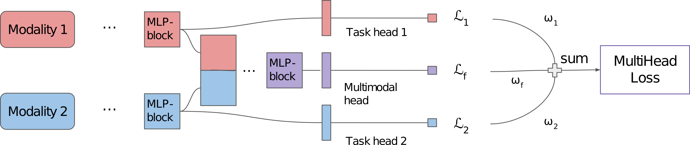

<br/>
<p align="center">

[//]: # (  <a href="https://github.com/bezirganyan/m2-mixer">)

[//]: # (    )

[//]: # (  </a>)

  <h3 align="center">M2-Mixer</h3>

  <p align="center">
    An official implementation for paper: <a href="https://ieeexplore.ieee.org/document/10386252">"M2-Mixer: A Multimodal Mixer with Multi-head Loss for Classification from Multimodal Data"</a>
    <br/>
    <br/>

[//]: # (    <a href="https://github.com/bezirganyan/m2-mixer/issues">Report Bug</a>)

[//]: # (    .)

[//]: # (    <a href="https://github.com/bezirganyan/m2-mixer/issues">Request Feature</a>)
  </p>

[//]: # (![Issues]&#40;https://img.shields.io/github/issues/bezirganyan/m2-mixer&#41; ![License]&#40;https://img.shields.io/github/license/bezirganyan/m2-mixer&#41; )

## Table Of Contents

* [About the Project](#about-the-project)
* [Built With](#built-with)
* [Getting Started](#getting-started)
  * [Prerequisites](#prerequisites)
  * [Installation](#installation)
* [Usage](#usage)
* [Contributing](#contributing)
* [Authors](#authors)
* [Acknowledgements](#acknowledgements)

## About The Project



In this paper, we propose M2-Mixer, an MLP9 Mixer based architecture with multi-head loss for multimodal classification. It achieves better performances than other baseline models with the main advantage of conceptual and computational simplicity as it only uses simple operations such as matrix multiplication, data layout change, and scalar non-linearity

## Built With

This code and experiments were possible due to these awesome open-source projects

* [Python](https://www.python.org/)
* [PyTorch](https://pytorch.org/)
* [PyTorch-Lightning](https://www.pytorchlightning.ai/index.html)
* [wandb](https://wandb.ai/)

## Getting Started

This repository will make it possible for other researchers to reproduce the results. 

### Prerequisites

Python 3.10.6 is used for the experiments.

### Datasets
#### AV-MNIST
The dataset can be downloaded from [here](https://drive.google.com/file/d/1KvKynJJca5tDtI5Mmp6CoRh9pQywH8Xp/view?usp=sharing).
Don't forget to change the path in the configuration file.

#### MIMIC-III
The dataset is not public, hence you need to apply for access [here](https://mimic.physionet.org/gettingstarted/access/).
After getting access, you can download the dataset from [here](https://physionet.org/content/mimiciii/1.4/), and
use the instructions of [this](https://github.com/pliang279/MultiBench#healthcare) repository to get the data in the format we used, 
or email the author of the repository to get the pre-processed file.

### Installation

Clone the repository and change the active directory with
```bash
git clone https://github.com/bezirganyan/m2-mixer.git
cd m2-mixer
```

We recommend to create a new virtual environment with
```bash
python3 -m venv venv
source venv/bin/activate
```
Install requirements with
```bash
pip install -r requirements.txt
```

## Usage

There are 2 scripts that can be used for training and testing: `run.py` and `run_for_significance.py`. The first one runs the code once, the second one runs several ones (default=10)) without resetting the random seed, to get the error bars. We will show the usage examples on `run.py`, as the interface is mostly the same for the `run_for_significance.py`.

To run you need to have the datasets, and the configuration files. You can get the ready configuration files from `cfg/` directory. Please refer to the Datasets section for downloading the datasets. 

To run `run.py` for training: 
```bash
python run.py -c [CONFIG PATH] -n "Experiment Name"
```
To run for test: 

```bash
python run.py -c [CONFIG PATH] -n "Experiment Name" -m test -p [CHECKPOINT PATH]
```
 We use wandb for logging the results, hence you need a wandb installed and configured. If you don't have that you can use the `--disable-wandb` flag to run the code. 

### Checkpoints

You can download the checkpoints from the following links:

<a href="https://anonfiles.com/61Z2r9s0z4/mimic_m2_mixer_H_ckpt">mimic_m2-mixer_H.ckpt</a> \
<a href="https://anonfiles.com/7fZer7sczd/mimic_m2_mixer_LC_ckpt">mimic_m2-mixer_LC.ckpt</a> \
<a href="https://anonfiles.com/8aZ1rds5zd/avmnist_m2_mixer_S_ckpt">avmnist_m2-mixer_S.ckpt</a> \
<a href="https://anonfiles.com/95Zares4z5/avmnist_m2_mixer_M_ckpt">avmnist_m2-mixer_M.ckpt</a> \
<a href="https://anonfiles.com/D1Z9rcs4zd/avmnist_m2_mixer_B_ckpt">avmnist_m2-mixer_B.ckpt</a>
